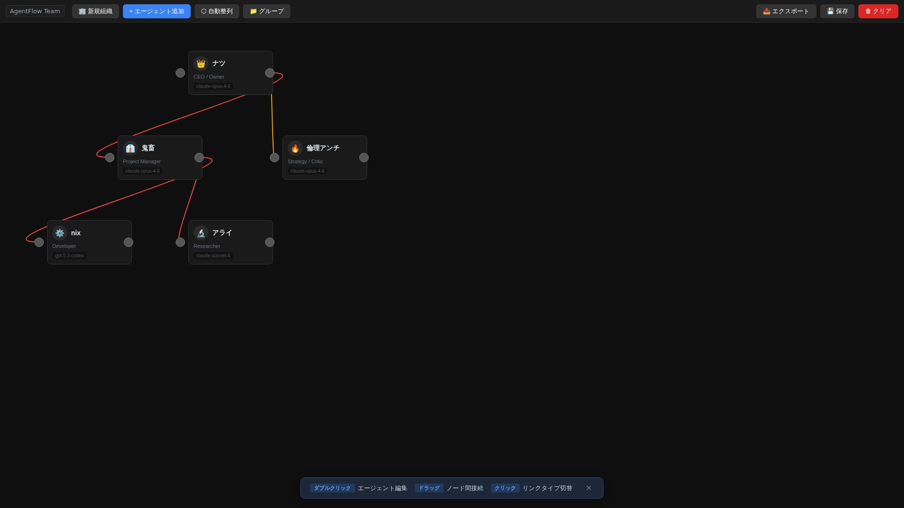

<div align="center">

# 🔀 AgentFlow

**Visual agent organization designer — Org chart editor → OpenClaw config export**

エージェント組織設計ツール — 組織図エディタ → OpenClaw config エクスポート

[](https://agentflow-l42k.vercel.app)
[](https://frexida.github.io/agentflow/editor/)
[](LICENSE)
[](https://frexida.github.io/agentflow/)

</div>

---

<div align="center">
  
  <p><em>Design, connect, and export your agent organization — all in the browser.</em></p>
</div>

<div align="center">
  
  <p><em>Design your agent organization visually — drag, connect, export.</em></p>
</div>

---

## Why AgentFlow?

OpenClaw lets you run multi-agent teams — but designing them means hand-editing YAML/JSON configs. AgentFlow gives you a **visual drag-and-drop editor** to design your agent org, then exports a ready-to-use OpenClaw config.

- 🎨 **Design visually** — Drag nodes, draw connections, see your org chart in real time
- ⚡ **Export instantly** — One click to generate OpenClaw-compatible config JSON + setup scripts
- 🚀 **Zero setup** — Works in the browser. No backend, no accounts, no install required
- 🏠 **Self-hostable** — Docker one-liner or static build for your own infra

> **No OpenClaw GUI for multi-agent design exists yet.** AgentFlow fills that gap.

---

## Quick Start

### Option A: Use it now (no install)

👉 **https://frexida.github.io/agentflow/editor/**

Data stays in your browser (localStorage). Nothing is sent to any server.

### Option B: Docker (self-hosted)

```bash
git clone https://github.com/Frexida/agentflow.git
cd agentflow
docker compose up -d
```

→ Open http://localhost:3000/editor/

### Option C: Local build

```bash
git clone https://github.com/Frexida/agentflow.git
cd agentflow
npm install
SITE_URL=http://localhost:4321 BASE_PATH=/ npm run build
```

Serve `dist/` with any web server, or `npm run dev` for development.

---

## Features

### 🖼️ Visual Org Chart Editor

- **Drag & drop** nodes to arrange your agent hierarchy
- **Auto-layout** with dagre for clean org charts
- **Connection types** — authority (🔴), communication (🔵), review (🟡)
- Click links to toggle type, double-click for detailed editing

### 🤖 Agent Configuration

Double-click any node to configure:

| Setting | Description |
|---------|-------------|
| Icon | Emoji identifier |
| Name & Role | Agent identity |
| Personality | Maps to `SOUL.md` |
| Model | Claude, GPT, Gemini, etc. |
| System Prompt | Core instructions |
| Tool Profile | minimal / coding / messaging / full |
| Initial Memory | Maps to `MEMORY.md` |

### 📁 Group Management

Organize agents into teams/departments with nested group support.

### 📤 One-Click Export

Generates 3 files:

1. **OpenClaw config JSON** — Drop into `config.apply` directly
2. **Full export JSON** — Config + metadata + workspace files
3. **Setup script** — Shell script to create agent workspaces

### ✅ Built-in Validation

Catches errors before export:
- ❌ No agents, duplicate names, unnamed agents
- ⚠️ Missing roles, empty prompts, disconnected nodes

### 💾 Auto-Save

Saves to localStorage every 5 seconds. Manual save button available.

---

## How to Use

### 1. Design your org

Add agents with the **+ エージェント追加** button. Drag them to arrange your hierarchy. Connect nodes by dragging from output ports to input ports.

### 2. Configure agents

Double-click any node to open the side panel. Set name, role, personality (becomes `SOUL.md`), model, tools profile, and initial memory (becomes `MEMORY.md`).

### 3. Define relationships

- **Drag** between nodes to create connections (default: authority)
- **Click** a connection line to cycle types: authority → communication → review
- **Double-click** a connection for detailed editing (type + label)

### 4. Export to OpenClaw

Click **📤 エクスポート** to generate:

```
my-org/
├── config.json          ← paste into openclaw config.apply
├── full-export.json     ← backup with metadata
└── setup.sh             ← creates agent workspaces:
    ├── agent-1/SOUL.md
    ├── agent-1/MEMORY.md
    ├── agent-2/SOUL.md
    └── ...
```

### 5. Apply the config

```bash
# Run the setup script to create workspace files
chmod +x setup.sh && ./setup.sh

# Apply the config to your OpenClaw instance
# Replace REPLACE_WITH_* placeholders with actual Discord/channel IDs
openclaw config apply < config.json
```

That's it — your agents are live with the org structure you designed.

---

## Self-Hosting

### Environment Variables

| Variable | Default | Description |
|----------|---------|-------------|
| `SITE_URL` | `https://frexida.github.io` | Your site URL |
| `BASE_PATH` | `/agentflow` | Base path (`/` for root) |

### Reverse Proxy

Set `SITE_URL` to your actual domain when building behind nginx/Caddy.

---

## Architecture

| Layer | Tech |
|-------|------|
| Framework | [Astro](https://astro.build/) (static output) |
| Editor | [Drawflow](https://github.com/jerosoler/Drawflow) |
| Layout | [dagre](https://github.com/dagrejs/dagre) |
| Data Model | MOISE+ Structural Specification (v1) |

Key source files:
- `src/pages/editor.astro` — Main editor UI
- `src/lib/types.ts` — Agent/Link/Group/Organization types
- `src/lib/export-openclaw.ts` — Organization → OpenClaw config

---

## v2 (Next.js + React Flow)

v2 is a complete rewrite with cloud features:

### Quick Start (v2)

```bash
cd v2
cp .env.example .env.local  # Add your Supabase keys
npm install
npm run dev
```

→ Open http://localhost:3000

### Environment Variables

```env
NEXT_PUBLIC_SUPABASE_URL=https://your-project.supabase.co
NEXT_PUBLIC_SUPABASE_ANON_KEY=your-anon-key
SUPABASE_SERVICE_ROLE_KEY=your-service-role-key  # Server only
```

### v2 Features
- **React Flow** canvas with custom agent nodes
- **Supabase Auth** (Email + GitHub OAuth)
- **Cloud save** with Row Level Security
- **Gateway integration** (OpenClaw Protocol v3)
- **Real-time chat** with agents via Gateway
- **Dark theme** (OpenClaw red #e94560)
- **⌨️ Keyboard shortcuts** — Ctrl+Z/Y (Undo/Redo), Ctrl+S (Save), Ctrl+D (Duplicate), Ctrl+A (Select All), Delete
- **↩️ Undo/Redo** — 50-state history stack with toolbar buttons
- **⌘K Command palette** — Fuzzy search commands + navigate to agents
- **💡 Onboarding tour** — 4-step guided walkthrough for new users
- **📋 Quick start checklist** — Progress tracker with auto-detection
- **🖼️ Export PNG/SVG/JSON** — High-res image export for presentations
- **📜 Version history** — Manual + auto-save (5min), restore any version

### Deploy to Vercel

1. Import repo, set Root Directory to `v2`
2. Add environment variables in Vercel dashboard
3. Deploy

---

## Contributing

Issues and PRs welcome. See [Issues](https://github.com/Frexida/agentflow/issues) for current tasks.

---

## License

MIT
