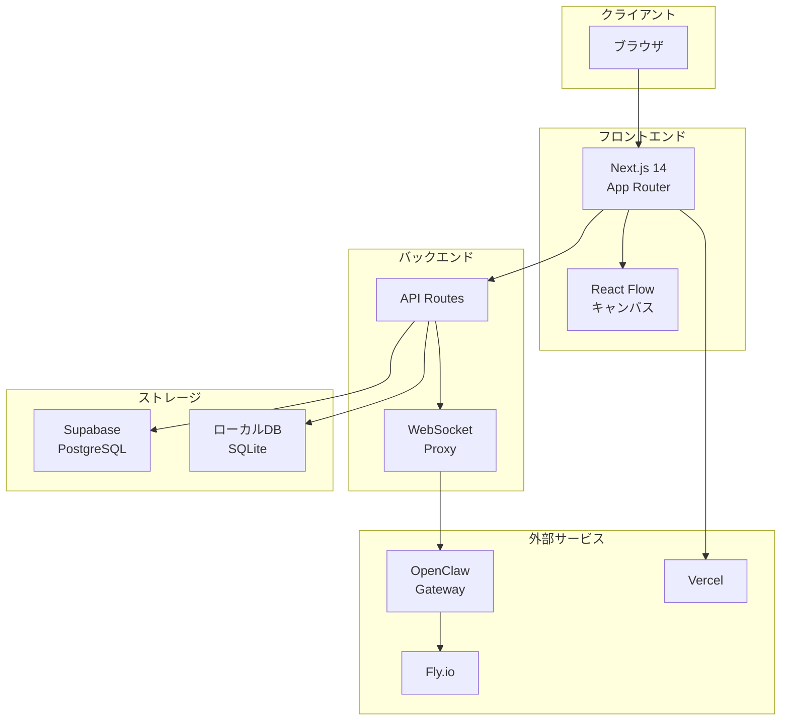
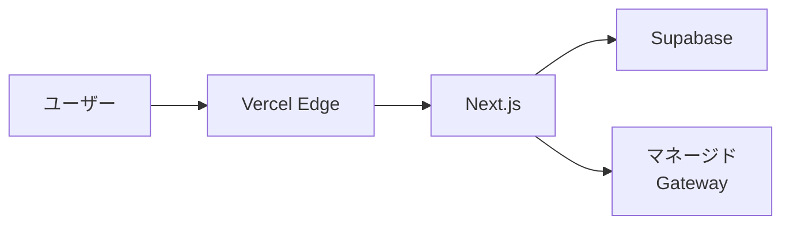
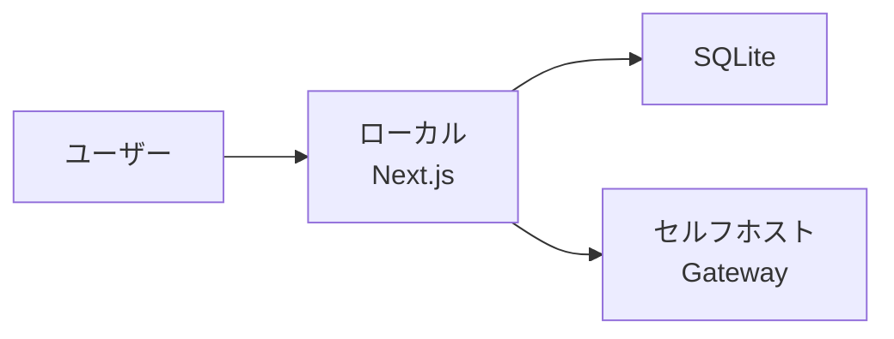
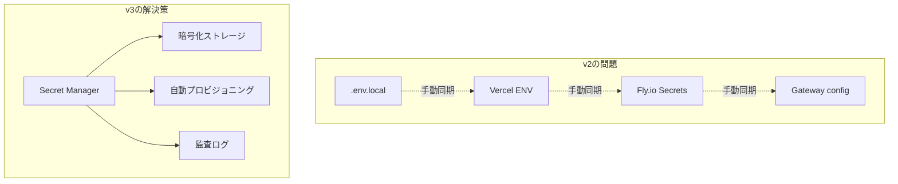
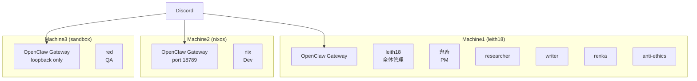

# システムアーキテクチャ

## 概要

AgentFlow v3 のシステム構成。

## 全体構成



## 技術スタック

| レイヤー | 技術 | 理由 |
|---------|------|------|
| フレームワーク | Next.js 14 (App Router) | RSC、API Routes統合 |
| キャンバス | React Flow | 4辺ポート、スマートルーティング |
| 状態管理 | Zustand | シンプル、TypeScript親和性 |
| DB（SaaS） | Supabase PostgreSQL | Auth統合、RLS |
| DB（セルフホスト） | SQLite + Drizzle | 軽量、ファイルベース |
| デプロイ | Vercel | Next.js最適化 |
| Gateway | Fly.io | グローバル分散 |

## デプロイ構成

### SaaS版



### セルフホスト版



## ディレクトリ構成（案）

```
/v3
├── src/
│   ├── app/           # Next.js App Router
│   │   ├── api/       # API Routes
│   │   ├── dashboard/ # ダッシュボード
│   │   ├── editor/    # エディタ
│   │   └── settings/  # 設定
│   ├── components/    # UIコンポーネント
│   │   ├── ui/        # 基本UI
│   │   ├── flow/      # React Flow関連
│   │   └── chat/      # チャットパネル
│   ├── lib/           # ユーティリティ
│   ├── store/         # Zustand stores
│   └── types/         # TypeScript型
├── docs/              # 設計ドキュメント（ここ）
├── tests/             # テスト（QA管理）
└── public/            # 静的ファイル
```

## Secret管理（v3新機能）



## 分散インフラ構成（現状）

AgentFlowチーム自体が分散環境で運用されている。

### マシン構成



### 分散の設計原則

| マシン | エージェント | 特性 | 理由 |
|--------|------------|------|------|
| **Machine1** | leith18, 鬼畜, etc. | プライベート情報多、制限あり | 秘書的役割、ナツの個人情報保護 |
| **Machine2** | nix | 開発用 | 開発環境特化 |
| **Machine3** | red | 全権付与、sandbox | 自由に動ける実験環境 |

### 設計への影響

- **Gateway間通信なし** — Discord経由でのみ連携
- **Workspace完全分離** — マシン間でファイルアクセス不可
- **セキュリティ境界** — 権限レベルが物理的に分離
- **Secret管理** — 各マシンで独立（同期が課題）

## TODO

- [ ] WebSocket プロトコル詳細
- [ ] キャッシング戦略
- [ ] エラーハンドリング
- [ ] モニタリング・ログ
- [ ] 分散Gateway間の連携プロトコル
