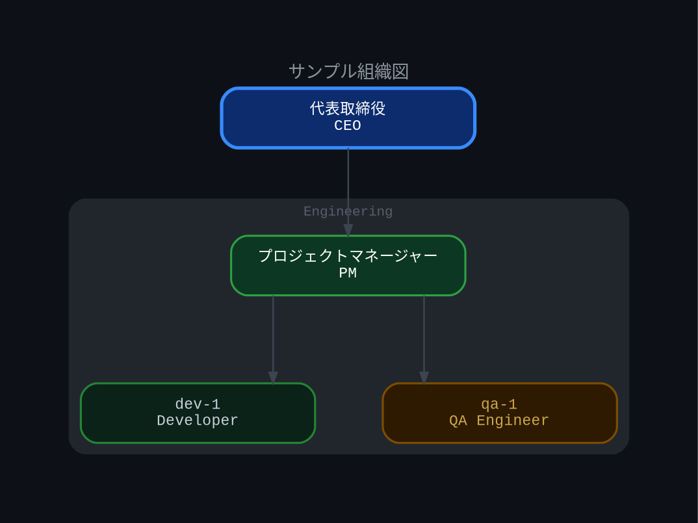

# 組織図・ダイアグラム生成標準

本ドキュメントは AgentFlow プロジェクトにおける組織図・構成図の作成標準を定める。

---

## 1. 使用ツール

**Graphviz (`dot` コマンド)** を標準ツールとして使用する。

### インストール確認

```bash
dot -V
```

### PNG 生成コマンド（標準）

```bash
dot -Tpng -Gdpi=192 input.dot -o output.png
```

| オプション | 説明 |
|---|---|
| `-Tpng` | 出力フォーマット (PNG) |
| `-Gdpi=192` | 高解像度出力 (Retina 対応) |
| `-o output.png` | 出力ファイル名 |

---

## 2. グラフ基本設定

```dot
digraph MyChart {
    graph [
        bgcolor="#0D1117"
        rankdir=TB
        splines=ortho
        nodesep=0.7
        ranksep=0.9
        fontname="Courier New"
        fontcolor="#8B949E"
        fontsize=13
        pad=0.6
        label="チャートタイトル"
        labelfontsize=14
        labelfontcolor="#6E7681"
        labelloc=t
    ]
    node [
        shape=box
        style="filled,rounded"
        fontname="Courier New"
        fontsize=11
        margin="0.25,0.14"
        penwidth=1.5
        width=2.4
    ]
    edge [
        fontname="Courier New"
        fontsize=9
        fontcolor="#555E6A"
        color="#3D4450"
        penwidth=1.2
        arrowsize=0.8
    ]
}
```

### 重要設定項目

| 設定 | 値 | 説明 |
|---|---|---|
| `bgcolor` | `#0D1117` | 背景色（ダークテーマ） |
| `rankdir` | `TB` | 上から下へのレイアウト |
| `splines` | `ortho` | **直角線**（必須） |
| `nodesep` | `0.7` | ノード間の水平間隔 |
| `ranksep` | `0.9` | ランク間の垂直間隔 |

> **重要:** `splines=ortho` は必須設定。曲線 (`splines=curved`) や斜め線 (`splines=line`) は使用禁止。

---

## 3. ダークテーマ配色原則

### 3.1 背景・境界線

| 要素 | カラーコード | 用途 |
|---|---|---|
| メイン背景 | `#0D1117` | グラフ全体の背景 |
| サブグラフ背景 | `#11151C` | クラスター内背景 |
| ネスト背景 | `#0D1117` | 深いネストの背景 |
| 境界線 | `#21262D` | クラスター枠線 |
| エッジ | `#3D4450` | 矢印・接続線 |

### 3.2 役職別カラーコード表

| 役職 | fillcolor | fontcolor | color (枠線) | penwidth |
|---|---|---|---|---|
| **CEO / PO** | `#0D2C6E` | `#FFFFFF` | `#388BFD` | `2.5` |
| **Manager / 監査** | `#4A0E0E` | `#FFFFFF` | `#F85149` | `2.0` |
| **Project Manager** | `#0C3823` | `#FFFFFF` | `#2EA043` | `1.5` |
| **Developer** | `#0A2218` | `#C9D1D9` | `#238636` | `1.5` |
| **Quality Assurance** | `#2E1A00` | `#CCA750` | `#7D4E00` | `1.5` |
| **Designer** | `#1F1040` | `#C9A8FF` | `#5A2EC4` | `1.5` |
| **DevOps / Docs** | `#151D2B` | `#C9D1D9` | `#3D4450` | `1.5` |
| **Secretary / Personal** | `#161B22` | `#8B949E` | `#30363D` | `1.5` |

### 3.3 配色の考え方

- **重要度が高いほど彩度を上げる**: CEO は濃い青、Manager は濃い赤で視覚的に強調
- **テキストは常に背景とのコントラストを確保**: 暗い背景には `#FFFFFF` または `#C9D1D9`
- **枠線色は fillcolor より明るい同系色**: ノードの輪郭を際立たせる

---

## 4. ノードラベルの書き方

### 4.1 HTMLラベル（必須形式）

複数行テキストは **HTMLラベル** を使用する。`<BR/>` タグで改行する。

```dot
NODE_ID [
    label=<1行目テキスト<BR/>2行目テキスト>
    fillcolor="#0D2C6E"
    fontcolor="#FFFFFF"
    color="#388BFD"
]
```

### 4.2 禁止事項

| 禁止 | 理由 | 代替 |
|---|---|---|
| 絵文字 (`🔥` など) | フォント非対応で文字化け | テキストのみ使用 |
| `\n` リテラル | HTMLラベル内では無効 | `<BR/>` を使用 |
| `\\n` エスケープ | 同上 | `<BR/>` を使用 |

### 4.3 ラベル例

```dot
// 良い例
NATSU [label=<ナツ<BR/>CEO / PO>]

// 悪い例（禁止）
NATSU [label="ナツ\nCEO / PO"]     // \n は無効
NATSU [label="ナツ🎯\nCEO / PO"]   // 絵文字も禁止
```

---

## 5. クラスター（グループ）の定義

関連するノードをグループ化するには `subgraph cluster_*` を使用する。

```dot
subgraph cluster_devteam {
    label="  Dev Team  "
    fontcolor="#555E6A"
    fontsize=9
    color="#21262D"
    bgcolor="#0D1117"
    style="rounded,filled"

    // ノードをここに配置
    DEV1 [label=<dev-1<BR/>Developer> ...]
}
```

| 設定 | 説明 |
|---|---|
| `label` | クラスターのタイトル（前後にスペースを入れると見栄えが良い） |
| `style="rounded,filled"` | 角丸・塗りつぶし |
| `bgcolor` | クラスター内の背景色 |
| `color` | クラスターの枠線色 |

---

## 6. エッジ（矢印）の書き方

### 6.1 通常の接続

```dot
NATSU -> RED
RED -> PM1
```

### 6.2 特殊な関係（破線）

エスカレーションや例外的な報告ラインは破線で表現する。

```dot
PM1 -> QA1 [style=dashed xlabel="escalation" constraint=true]
QA1 -> RED [style=dashed xlabel="direct NG report" constraint=false]
```

| 属性 | 説明 |
|---|---|
| `style=dashed` | 破線スタイル |
| `xlabel` | エッジラベル（ノードの外側に表示） |
| `constraint=false` | レイアウトのランク制約を無効化（逆方向の接続など） |

---

## 7. 完全なサンプル

以下は標準的な組織図の最小構成例:



---

## 8. 生成手順まとめ

```bash
# 1. DOT ファイルを作成・編集
vim myorg.dot

# 2. 構文チェック
dot -Tpng myorg.dot -o /dev/null

# 3. PNG を生成（高解像度）
dot -Tpng -Gdpi=192 myorg.dot -o myorg.png

# 4. SVG も必要な場合
dot -Tsvg myorg.dot -o myorg.svg
```

> **ヒント:** `-Gdpi=192` は Retina / HiDPI ディスプレイ向けの設定。通常の用途では `-Gdpi=96` でも可。

---

## 9. チェックリスト

ダイアグラムを作成・レビューする際は以下を確認する:

- [ ] `splines=ortho` が設定されている（直角線）
- [ ] 背景色 `bgcolor="#0D1117"` でダークテーマになっている
- [ ] ラベルは `<BR/>` による HTMLラベル形式を使用している
- [ ] 絵文字・`\n` リテラルを使用していない
- [ ] 役職に対応したカラーコード表に従った配色になっている
- [ ] `dot -Tpng -Gdpi=192` で正常に PNG が生成できる
