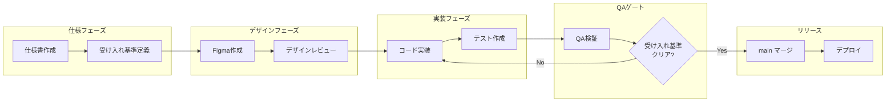
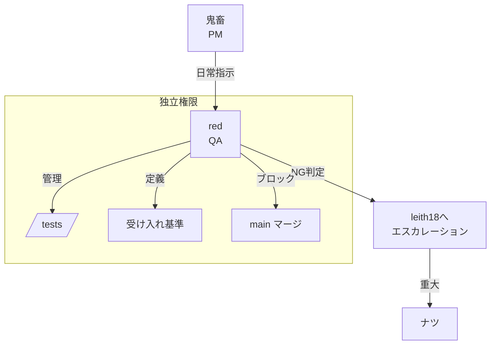
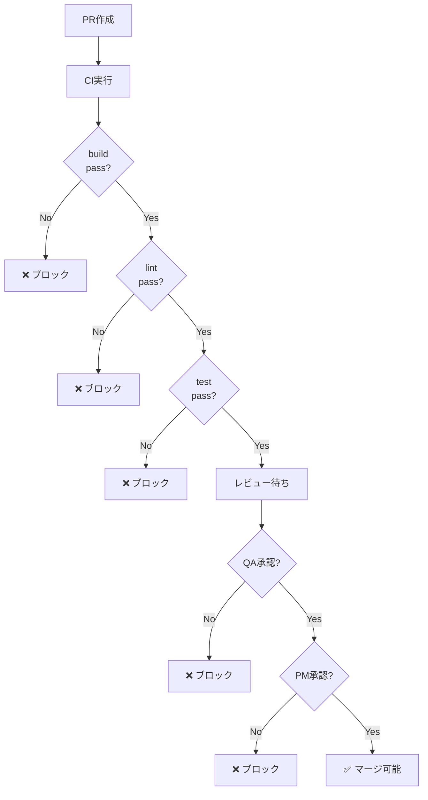

# Gate System

## 概要

**Gate System** = 品質基準をクリアするまで次フェーズに進めない仕組み。
QAの「NG」判定がPM判断より上位。

## 開発フロー



## Gate定義

| Gate | 担当 | 基準 | ブロック条件 |
|------|------|------|-------------|
| **仕様承認** | PM(鬼畜) | 要件が明確 | 曖昧な項目がある |
| **デザイン承認** | designer + PM | Figma完成 | UI未定義 |
| **コードレビュー** | nix + PM | 実装完了 | バグ、設計違反 |
| **QA承認** | red | 受け入れ基準全クリア | テスト失敗 |
| **最終承認** | leith18 | 本番ready | 重大issue未解決 |

## QA独立性



## 受け入れ基準テンプレート

```markdown
## 機能名: [機能名]

### 受け入れ基準

- [ ] 基準1: [具体的な条件]
- [ ] 基準2: [具体的な条件]
- [ ] 基準3: [具体的な条件]

### テストケース

| ID | シナリオ | 期待結果 | 実行結果 |
|----|---------|---------|---------|
| TC-001 | [操作] | [結果] | ⬜ |
| TC-002 | [操作] | [結果] | ⬜ |

### Gate判定

- [ ] 全テストケースPASS
- [ ] パフォーマンス基準クリア
- [ ] セキュリティレビュー完了
- [ ] ドキュメント更新完了

**QA判定**: ⬜ PASS / ⬜ NG
**NG理由**: 
```

## GitHub連携

### Branch Protection

```yaml
main:
  required_reviews: 2
  required_reviewers:
    - @agentflow-pm   # PM承認
    - @agentflow-qa   # QA承認
  require_status_checks:
    - "QA: acceptance-tests"
    - "ci: build"
    - "ci: lint"
  dismiss_stale_reviews: true
```

### CI/CD Gate


