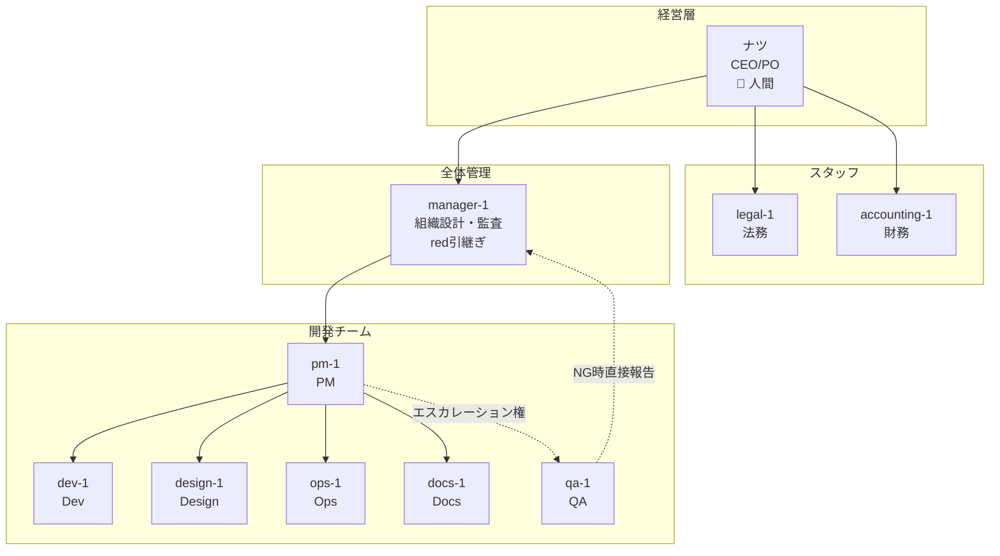

# 組織図・役割定義

## 役割分離の原則

AgentFlow v3 では「ナツ個人用」と「標準化チーム」を明確に分離する。

| 区分 | 目的 | エージェント |
|------|------|-------------|
| **ナツ個人用** | 秘書・個人開発 | leith18, 鬼畜, nix |
| **v3標準化チーム** | AgentFlowのdogfooding | pm-1, dev-1, qa-1, design-1 等 |

**理由**: AgentFlowの汎用性を証明するため、個性を排除し再現可能な構成を作る。

---

## v3 標準化チーム組織図



## 役割定義（v3 標準化チーム）

| ID | 役割 | 責務 | レポート先 |
|----|------|------|-----------|
| - | **CEO/PO** | 方向性決定、最終承認 | - |
| **manager-1** | 全体管理 | 進捗監視、ブロッカー対応、PM監査 | ナツ |
| **pm-1** | PM | タスク分解、スケジュール、チーム調整 | manager-1 |
| **dev-1** | Dev | 実装、インフラ | pm-1 |
| **qa-1** | QA | テスト、品質保証、Gate管理 | pm-1（NG時manager-1直接） |
| **design-1** | Design | UI/UX、Figma | pm-1 |
| **ops-1** | Ops | CI/CD、デプロイ、監視 | pm-1 |
| **docs-1** | Docs | 仕様書、ドキュメント | pm-1 |
| **legal-1** | 法務 | 規約、契約、コンプライアンス | ナツ |
| **accounting-1** | 財務 | 会計、請求、収支管理 | ナツ |

## エージェントテンプレート

```yaml
# 例: qa-1 ロール定義
role: qa
id: qa-1
capabilities:
  - browser
  - exec
  - e2e-testing
responsibilities:
  - 受け入れ基準の定義（仕様フェーズ）
  - E2Eテスト実行
  - Gate判定（OK/NG）
  - NGのエスカレーション
scope: /v3/tests/
escalation_to: manager-1
```

## 命名規則

| パターン | 例 | 用途 |
|---------|-----|------|
| `{role}-{number}` | pm-1, dev-1 | 標準化チーム |
| 固有名詞 | leith18, 鬼畜 | ナツ個人用（v3では非推奨） |

## エージェント作成状況

### v3 標準化チーム

| ID | 状態 | workspace |
|----|------|-----------|
| manager-1 | 🔲 red引継ぎ予定 | `/workspace-manager-1` |
| pm-1 | 🔲 未作成 | `/workspace-pm-1` |
| dev-1 | 🔲 未作成 | `/workspace-dev-1` |
| qa-1 | 🔲 未作成 | `/workspace-qa-1` |
| design-1 | 🔲 未作成 | `/workspace-design-1` |
| ops-1 | 🔲 未作成 | `/workspace-ops-1` |
| docs-1 | 🔲 未作成 | `/workspace-docs-1` |

### ナツ個人用（継続稼働）

| エージェント | 状態 | 役割 |
|-------------|------|------|
| leith18 | ✅ 稼働中 | 秘書 |
| 鬼畜 | ✅ 稼働中 | 秘書 |
| nix | ✅ 稼働中 | 個人開発 |
