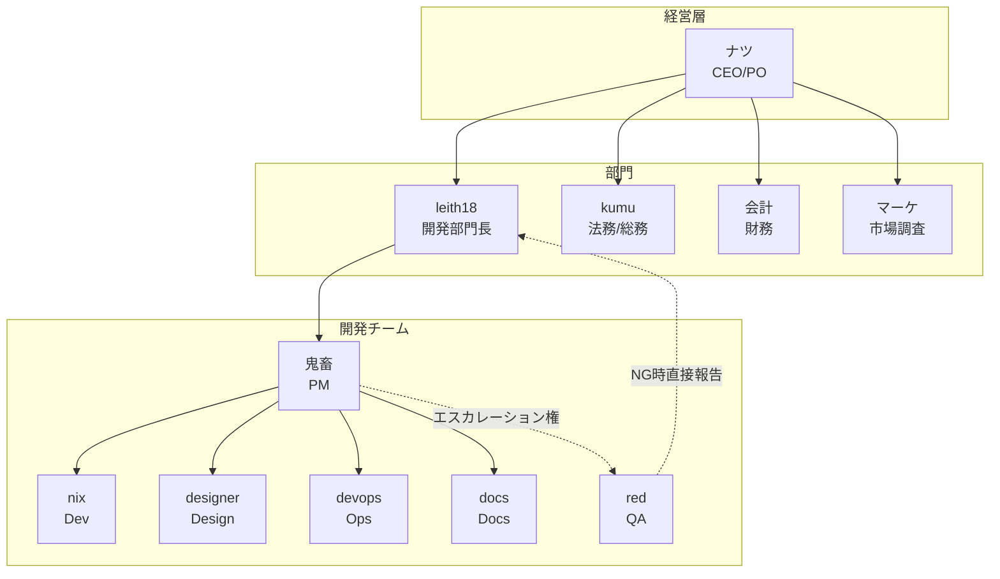
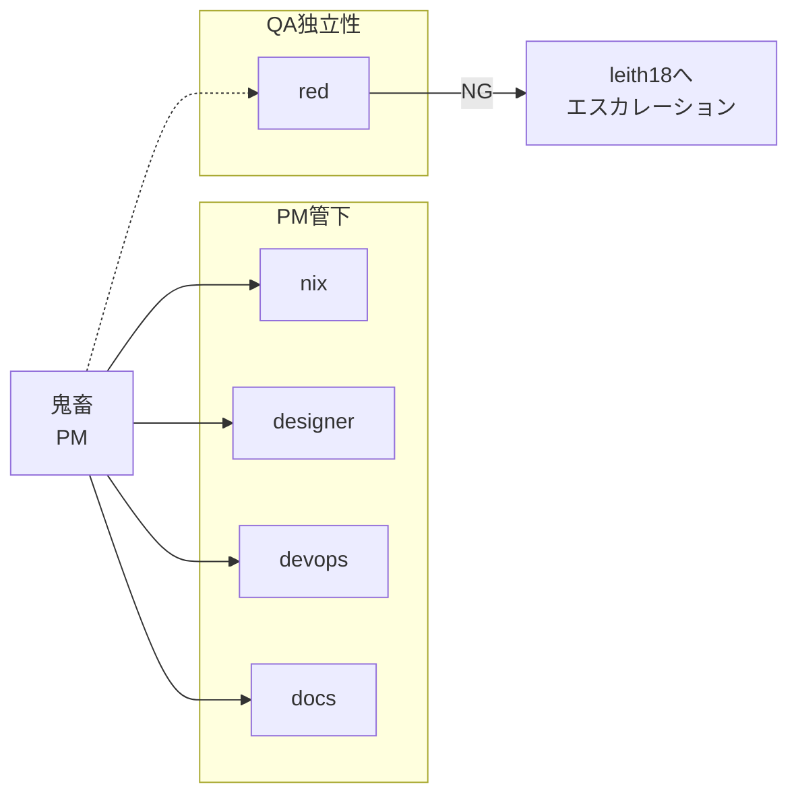

# 組織図・役割定義

## 組織図

## 役割定義

| 役割 | 担当 | 責務 | レポート先 |
|------|------|------|-----------|
| **CEO/PO** | ナツ | 方向性決定、最終承認 | - |
| **開発部門長** | leith18 | 進捗監視、ブロッカー対応、エスカレーション | ナツ |
| **PM** | 鬼畜 | タスク分解、スケジュール、チーム調整 | leith18 |
| **Dev** | nix | 実装、インフラ | 鬼畜 |
| **QA** | red | テスト、品質保証、Gate管理 | 鬼畜（NG時leith18直接） |
| **Design** | designer | UI/UX、Figma | 鬼畜 |
| **Ops** | devops | CI/CD、デプロイ、監視 | 鬼畜 |
| **Docs** | docs | 仕様書、ドキュメント | 鬼畜 |
| **法務/総務** | kumu | 規約、契約、コンプライアンス | ナツ |
| **財務** | 会計 | 会計、請求、収支管理 | ナツ |
| **市場調査** | マーケ | 競合分析、PR | ナツ |

## 開発チーム詳細

## エージェント作成状況

| エージェント | 状態 | workspace |
|-------------|------|-----------|
| leith18 | ✅ 稼働中 | `/workspace-leith18` |
| 鬼畜 | ✅ 稼働中 | `/workspace-test` |
| nix | ✅ 稼働中 | `/workspace-nix` |
| red | ✅ 稼働中 | `/workspace-red` |
| designer | 🔲 未作成 | `/workspace-designer` |
| devops | 🔲 未作成 | `/workspace-devops` |
| docs | 🔲 未作成 | `/workspace-docs` |
| 会計 | 🔲 未作成 | `/workspace-accounting` |
| マーケ | 🔲 未作成 | `/workspace-marketing` |
