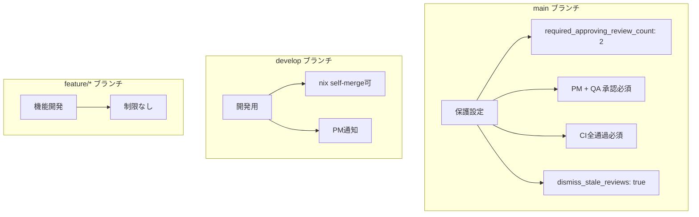
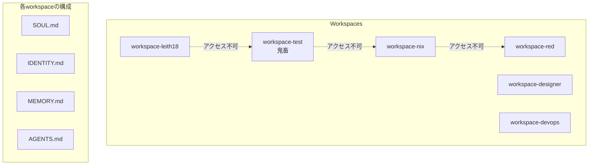

# 権限設計

## 設計原則

**「プロンプトではなくシステムで制御」**

エージェントは「信頼できないから制限する」のではなく、
「制限があるから安心して動ける」。

## プロンプト vs システム

| レイヤー | プロンプト（弱） | システム（強） |
|----------|-----------------|---------------|
| ファイル | 「触るな」と書く | workspace分離で**アクセス不可** |
| Git | 「直接pushするな」 | branch protectionで**push不可** |
| デプロイ | 「勝手にやるな」 | Vercel/Fly.io権限で**実行不可** |
| API | 「使いすぎるな」 | Rate limit / 別キーで**制限** |
| DB | 「他人のデータ見るな」 | RLSで**クエリ不可** |
| テスト | 「テストを消すな」 | CODEOWNERSでQA以外**変更不可** |

## GitHub権限設計

### CODEOWNERS

```
# 全体（ナツ最終承認）
* @mtdnot

# 開発部門（leith18承認）
/v3/ @leith18-bot

# 実装（nix管理）
/v3/src/ @nix-bot

# UI/UX（designer管理）
/v3/src/**/*.css @designer-bot
/v3/src/components/ui/ @designer-bot

# テスト（QA管理 - red以外変更不可）
/v3/tests/ @red-bot

# インフラ（devops管理）
/.github/ @devops-bot
/v3/Dockerfile @devops-bot
/v3/fly.toml @devops-bot

# ドキュメント
/docs/ @docs-bot
```

### Branch Protection Rules



### GitHub Teams

| Team | メンバー | 権限 |
|------|---------|------|
| `@Frexida/agentflow-admin` | ナツ, leith18 | Admin |
| `@Frexida/agentflow-pm` | 鬼畜 | Maintain |
| `@Frexida/agentflow-core` | nix, designer, devops, docs | Write |
| `@Frexida/agentflow-qa` | red | Write + CODEOWNERS権限 |

## Workspace分離



## API権限（将来）

| エージェント | OpenClaw API | GitHub API | Vercel API | Supabase |
|-------------|-------------|------------|------------|----------|
| leith18 | full | admin | admin | admin |
| 鬼畜 | read | maintain | read | read |
| nix | read | write | deploy | write |
| red | read | write(/tests/) | read | read |
| designer | read | write(/ui/) | - | - |
| devops | read | write(/.github/) | deploy | - |
